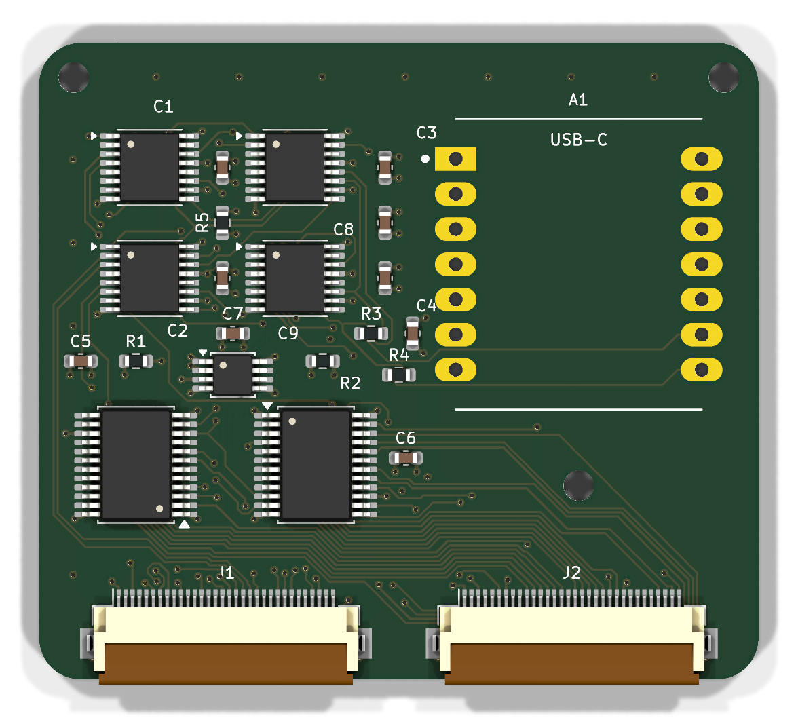
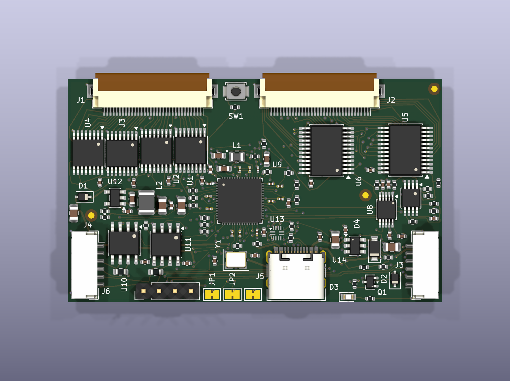

# TaxelScan

**An open reader board and embedded conditioning stack for flexible resistive
tactile matrices.**

TaxelScan reads a 16 × 32 pressure surface (512 taxels) at 80 frames per second
by default and has been measured at 200 fps. An RP2350 turns the raw matrix
into a cleaned pressure map and contact records—area, force proxy, peak,
centroid, and bounds—before the data reaches the host.

<p align="center">
  
</p>

The project is more than a matrix multiplexer. Its main contribution is the
combination of a purpose-built analog readout and a contact-safe conditioning
pipeline that handles electronic drift, sensor-film creep, impulses, and
isolated phantoms without absorbing a sustained grasp.

## Two boards

| | rev-1 (built, measured) | rev-3 (designed, fab package ready) |
|---|---|---|
| Sensor | 16 × 32 Velostat mat, one per board | 32 × 32 carbon-nanotube mat (~1 MΩ), one per board, up to eight boards on one harness |
| Controller | Seeed XIAO RP2350 module, internal 12-bit ADC | bare RP2354A (2 MB flash in package), external LTC1865L 16-bit SAR |
| Row drive | 4 × SN74LVC595A, 32 actively driven rows | unchanged |
| Column readout | 2 × CD74HC4067, two banks | unchanged |
| Analog front end | 3.3 kΩ sense pulldowns, TLV9062 unity-gain buffers | 10 kΩ thin-film pulldowns, TLV9062 gain of 6, 51 Ω + 1 nF C0G charge reservoirs, reference tapped ratiometrically off the row rail |
| Interconnect | USB-C on the module | USB-C with an ESD array and a hot-plug damper, plus two RS-485 pairs (data and frame-sync) on 6-way JST GH harness connectors, with protected 5 V injection from the master's USB port |
| Board | 52 × 46 mm, 4 layer | 60.3 × 35.9 mm, 4 layer, single-sided assembly, 0201/0402 passives |
| State | shipped; all firmware numbers in this README were measured on it | routed, DRC-clean, every BOM line verified against LCSC, JLCPCB package in `boards/rev3/fab/`; no firmware yet |

<p align="center">
  
</p>

Unselected rows remain actively low, so matrix sneak paths terminate at a low
impedance instead of floating. The LVC row drivers also retain their output
level under the combined current of a heavily loaded row; that prevents drive
sag from appearing as lost pressure. rev-3 keeps exactly that topology and
checks it mechanically: its netlist is derived from rev-1's measured one by a
generator that asserts every property the design depends on, and a
fault-injection script proves the assertions bite.

<p align="center">
  
</p>

## Signal conditioning

<p align="center">
  
</p>

Core 1 scans on a fixed deadline while core 0 conditions and transmits the
previous frame. The scan therefore keeps a stable sample clock even when USB or
the host stalls.

Three details carry most of the design:

- **Live dark reference.** Every row is driven low before and after the row
  walk. That bracketed measurement captures ADC offset, amplifier offset, mux
  leakage, and supply movement, and remains valid while the sensor is pressed.
- **Contact-safe adaptive baseline.** Falling correction is fast and ungated;
  rising correction is slow, capped, and frozen around active contacts. Spatial
  coherence and edge motion keep a static grasp from being learned away.
- **Contact extraction on the MCU.** Per-taxel thresholds, hysteresis,
  debounce, isolated-speck removal, and connected components produce useful
  contacts rather than asking every host to reinterpret raw ADC counts.

At the default 12.5 ms frame period, the measured 16 × 32 scan takes 10.86 ms
and conditioning takes 1.76 ms on the other core. The fastest measured setting
completed 2,999 frames in 15 seconds at 200 fps with no new overruns. See the
[firmware documentation](firmware/README.md) for the full timing table,
calibration procedure, diagnostics, runtime options, protocol, and simulator
results.

## Repository

```text
boards/            one self-contained KiCad project per board (see boards/README.md)
  rev1/            the shipped single-sensor reader: schematic, routed PCB, gerbers, BOM, renders
  fork-adapter/    passive two-finger sensor adapter
  rev3/            the multi-board design: generator, schematic, routed PCB, fab/ package,
                   design notes (README, AUDIT, ROUTING_STATUS, USB_POWER, PLACEMENT)
  v2-module/, v2-hub/   a shelved split design, kept for the method (see boards/README.md)
libraries/         the FlexiTac symbols and footprints shared by every board
firmware/          rev-1 firmware (taxelscan/), native simulator, host tools,
                   the rev-3 USB power controller (rev3_power/) and the rev-3 plan (rev3/PLAN.md)
assets/            README animation and pipeline diagram
```

Two folders are deliberately absent from the repository and listed in
`.gitignore`: `tmp/`, the scratch area the rev-3 routing tools use (it holds a
few hundred megabytes of router runs and a private copy of their Python
dependencies), and `boards/rev3/backups/`, the dated recovery points the rev-3
notes refer to. Both stay on the machine the work was done on. Everything the
notes describe as a result is in the tree.

## Quick start (rev-1 hardware)

```bash
cd firmware
arduino-cli compile --fqbn rp2040:rp2040:seeed_xiao_rp2350 --build-path "$PWD/build" taxelscan
arduino-cli upload -p COM10 --fqbn rp2040:rp2040:seeed_xiao_rp2350 --input-dir "$PWD/build" taxelscan
python tools/taxelscan_live.py --port COM10
```

The viewer serves the live heatmap at `http://localhost:8000`.

**Do not flash this firmware to a rev-3 board.** It drives pins that are the
address straps and the power-fault input there, and reads an internal ADC the
rev-3 board does not use. [firmware/rev3/PLAN.md](firmware/rev3/PLAN.md) is the
specification for the rev-3 firmware, which has not been written yet.

## Ordering a rev-3 board

`boards/rev3/fab/` is the JLCPCB package: `rev3-gerbers.zip`, drill files, and
two assembly sets (`rev3-bom.csv` + `rev3-cpl.csv` for boards in the middle of
a harness, the `-end` pair for the two terminated boards at its ends).
`fab/ORDER-NOTES.txt` lists the options to select, in particular epoxy-filled
and capped vias and Standard PCBA, and what to check in the placement preview.
`boards/rev3/README.md` has the design rationale, `AUDIT.md` the verification
record, and `ROUTING_STATUS.md` what is still open (hot-plug overshoot is
unmeasured; the front end has not been measured on hardware).

## Credits and license

The sensor pads, electrode geometry, and original readout topology come from
the FlexiTac project. TaxelScan is an independent reader board and firmware
implementation. The repository is MIT licensed; see [LICENSE](LICENSE).
