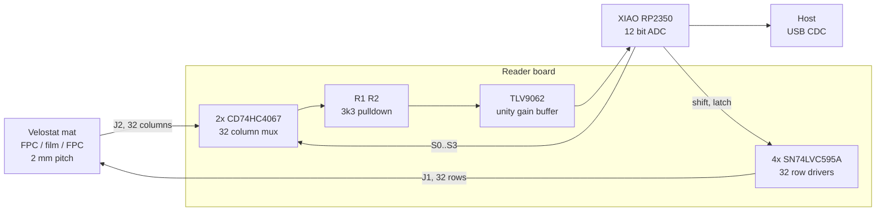

# TaxelScan

An open readout board and firmware for FlexiTac-style Velostat pressure mats.

The sensor pad is a passive resistive matrix: two sets of electrodes printed on
flexible PCB, separated by a piezoresistive film, so every row/column crossing
forms one variable resistor. Reading it means driving one row at a time and
measuring what arrives on each column. That part is straightforward. Everything
difficult about these sensors happens afterwards, in deciding which of the
numbers coming back represent something touching the mat.

This project is a reader board built around a XIAO RP2350, plus firmware that
does the conditioning on the microcontroller instead of shipping raw counts to
a host. It scans 512 taxels at 80 frames per second by default and has been
measured at 200 frames per second, and it emits both a cleaned pressure map and
a list of detected contacts.

## Status

The board works. The firmware scans, conditions, and streams. The measurements
quoted throughout this repository were taken on hardware, not estimated.

Two things are still open and are documented where they matter:

- The column tail seating is imperfect. A no-press connectivity sweep finds 9
  columns strongly connected, 10 marginal and 13 open, repeatably. See
  [firmware/README.md](firmware/README.md) for how to run that sweep.
- Per-taxel noise calibration works but currently measures near zero on a quiet
  bench, so the absolute threshold floors dominate. It needs to be run under the
  noise the sensor will actually face.

## How it compares to the FlexiTac reference readout

The FlexiTac project publishes a reference readout built on an Arduino Nano.
The pads are the same. The difference is entirely in the electronics and the
firmware.

| | FlexiTac reference | This reader |
|---|---|---|
| MCU | ATmega328P, 8 bit, 16 MHz | RP2350, dual Cortex-M33, 150 MHz |
| Row drivers | 74HC595 | SN74LVC595A |
| Column select | 2x 16 channel mux | 2x CD74HC4067 |
| Sense buffer | none | TLV9062 unity gain |
| ADC | 10 bit, transmitted as 8 | 12 bit |
| Frame rate | 100 Hz | 80 Hz default, 200 Hz measured |
| Conditioning | none, host receives raw counts | 10 stages, on the MCU |
| Drift handling | re-tare when it gets bad | per-frame dark reference plus gated adaptive baseline |
| Output | raw map | conditioned map plus contact list |
| Wire format | raw bytes | framed, length field, header CRC and payload CRC |

Three of those differences carry most of the practical weight.

**The row driver.** At 3.3 V an SN74LVC595A is specified for 24 mA with an
output high of 2.4 V, roughly 25 ohms of output impedance. A 74HC595 in the same
conditions manages a few milliamps. This matters because a driven row does not
just feed the one taxel being measured. Current also leaks through every other
taxel on that row into the columns and away to ground, and that sneak current
scales with how much of the mat is loaded. With a whole row pressed the driven
output can be asked for close to 30 mA. An HC part sags badly under that, and
the sag looks exactly like the pressure reading dropping. The LVC part holds.

**Where the conditioning runs.** The reference readout streams raw counts and
leaves interpretation to the host. Doing it on the MCU instead means the frame
clock is fixed rather than at the mercy of host scheduling, which matters
because every filter cutoff is defined against that clock. It also means the
consumer of the data, likely a control loop, gets values it can use without
reimplementing the pipeline.

**The dark reference.** Twice per frame every row is driven low and every column
is read. With nothing driving the matrix there is no current to steer, so that
reading is purely ADC offset, amplifier offset, mux leakage and whatever the
supply is doing at that instant. Subtracting it removes all of those. The useful
property is that the measurement stays valid while someone is pressing the mat,
because pressing it cannot change a reading taken with no excitation. That gives
a live re-zero that never needs an untouched sensor, which is the whole reason
this can run continuously on a robot without a calibration pause.

## How it compares to other tactile sensing approaches

Resistive matrices are one option among several, and the tradeoffs are real.
This is a category level comparison, not a product benchmark.

**Resistive matrix (this project, FlexiTac, most Velostat builds).** Cheap, thin,
conformable, and easy to make large. The film is the weak point: piezoresistive
material creeps under sustained load, shows hysteresis on release, and has
repeatability around ten percent. Good for contact location and relative force.
Poor for absolute force without per-taxel calibration.

**Capacitive arrays.** Better repeatability and much less drift than
piezoresistive film. The cost is sensitivity to grounding and to nearby
conductors, so shielding and reference design get harder, and a dedicated analog
front end is usually required rather than a plain ADC.

**Barometric taxels (a MEMS pressure die under a cast elastomer dome).** Good
absolute force accuracy and low drift, because the sensing element is a
calibrated pressure sensor rather than a bulk material. The cost is spatial
density and thickness. Each taxel is a discrete part, so a dense array gets
expensive and mechanically bulky quickly.

**Optical and camera based (the GelSight family).** By far the richest signal.
A camera watching a deformable gel recovers fine geometry, texture and shear,
none of which a resistive matrix can see at all. The cost is volume, a camera
and illumination per sensor, and significant compute.

**Commercial calibrated mats.** Come calibrated and supported, which is worth a
great deal if force accuracy is the requirement. Usually closed, usually
expensive, and often tied to vendor software that is awkward to put inside a
robot control loop.

If the requirement is knowing where contact is happening, roughly how hard, over
a large conformable area, at low cost, a resistive matrix is a reasonable
choice, and the firmware in this repository exists to deal with the drift and
creep that come with it. If the requirement is absolute force in newtons, a
different sensing principle will be less work than calibrating this one.

## Signal path



Unselected rows are held low by the shift register outputs rather than left
floating, so every sneak path in the matrix terminates at a low impedance
ground. One consequence is worth stating because it saves time later: a pressed
taxel adds a parallel path to ground on its column, which makes other readings
on that column slightly *lower*, never higher. Crosstalk on this topology cannot
manufacture a false contact.

## Repository layout

```
board/           KiCad project: schematic, PCB, gerbers, BOM
fork-adapter/    KiCad project: passive adapter for two-finger use
firmware/        Firmware, host tools, native simulator
```

- [firmware/README.md](firmware/README.md) covers the board, the conditioning
  pipeline, bring-up diagnostics, tuning and the wire protocol.
- [firmware/tools/README.md](firmware/tools/README.md) covers the live viewer,
  the spectrum tool and the protocol tests.

## Hardware summary

| Part | Function |
|---|---|
| A1 | Seeed XIAO RP2350 |
| U1 to U4 | SN74LVC595A, 32 row drivers |
| U5, U6 | CD74HC4067, 16 channel analog mux each |
| U7 | TLV9062 dual op-amp, unity gain sense buffers |
| R1, R2 | 3.3k sense pulldowns, one per mux common |
| R3, R4 | 33R series damping on SRCLK and RCLK |
| R5 | 0R jumper feeding ROW_VCC |
| J1, J2 | 32 way 0.5 mm FFC, rows and columns |

Four layer stackup with dedicated ground and power planes. Pin assignments are
listed in [firmware/taxelscan/scan.h](firmware/taxelscan/scan.h)
and were read from the assembled board netlist rather than assumed.

### Known hardware issues

The ROW_DATA net drops from the MCU pad onto the power plane layer, runs about
35 mm as an isolated trace through the pour, and returns to the top layer
through a single via. It is the only signal in the row chain with no series
resistor and no test point. On the first assembled board this net was open, and
finding that took a long time because the symptom (every row reading identically)
looks like a sensor fault rather than a broken trace. Give it a top layer route
on any respin, or at minimum a test pad.

## Quick start

Flash the firmware, then open the viewer:

```bash
cd firmware
arduino-cli compile --fqbn rp2040:rp2040:seeed_xiao_rp2350 --build-path "$PWD/build" taxelscan
arduino-cli upload -p COM10 --fqbn rp2040:rp2040:seeed_xiao_rp2350 --input-dir "$PWD/build" taxelscan
python tools/taxelscan_live.py --port COM10
```

The viewer serves a live heatmap on http://localhost:8000. Full setup, including
which Arduino core to install and why it has to be that one, is in
[firmware/README.md](firmware/README.md).

## Credits

The sensor pads, the electrode geometry and the original readout topology come
from the FlexiTac project. This repository is an independent reader board and
firmware for those pads. Pad fabrication and the reference design are documented
by the FlexiTac authors.

## License

MIT. See [LICENSE](LICENSE).

The KiCad project, the firmware and the host tools are all covered. The sensor
pads themselves are not part of this repository and are covered by whatever
terms the FlexiTac project applies to them.
