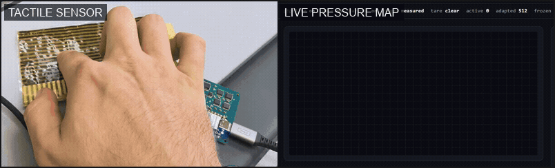
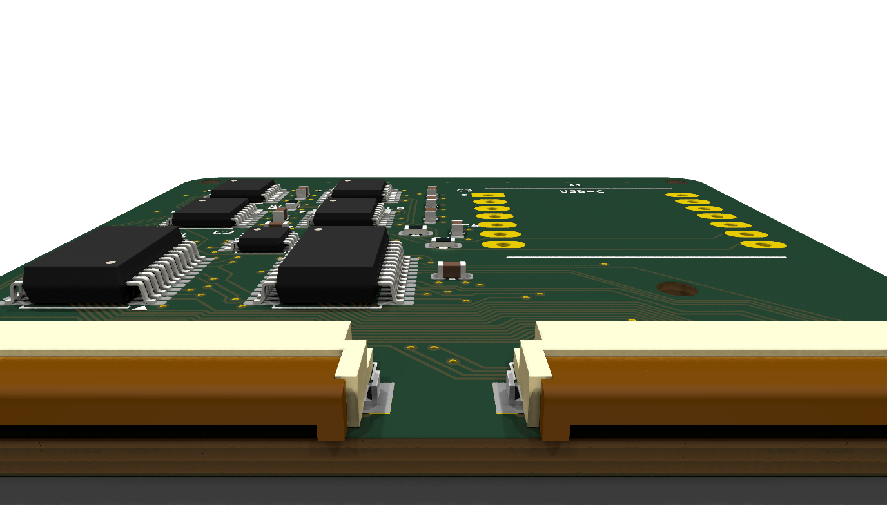
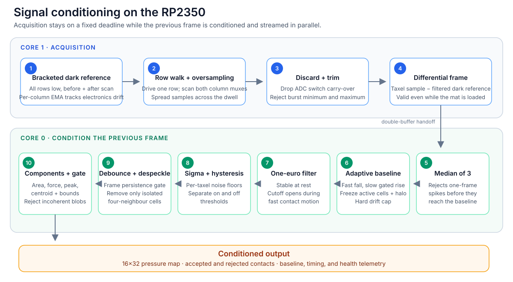
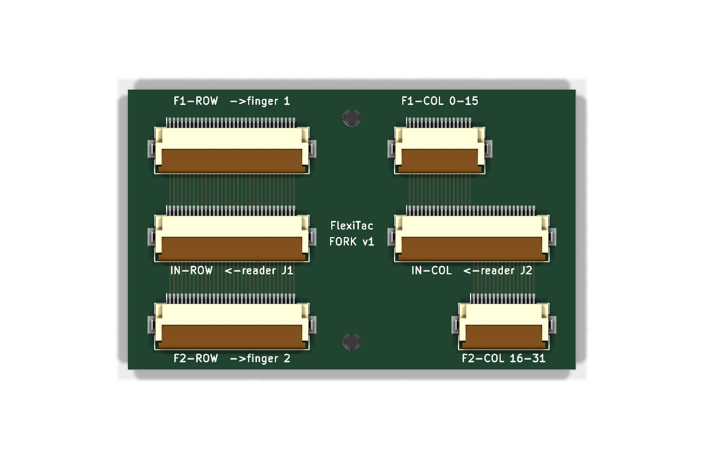

# TaxelScan

**An open reader board and embedded conditioning stack for flexible Velostat
tactile matrices.**

TaxelScan reads a 16 × 32 pressure surface (512 taxels) at 80 frames per second
by default and has been measured at 200 fps. A XIAO RP2350 turns the raw matrix
into a cleaned pressure map and contact records—area, force proxy, peak,
centroid, and bounds—before the data reaches the host.

<p align="center">
  
</p>

The project is more than a matrix multiplexer. Its main contribution is the
combination of a purpose-built analog readout and a contact-safe conditioning
pipeline that handles electronic drift, Velostat creep, impulses, and isolated
phantoms without absorbing a sustained grasp.

## Hardware

<p align="center">
  
</p>

| Block | Implementation |
|---|---|
| Controller | Seeed XIAO RP2350; 12-bit ADC; USB-C |
| Row drive | 4 × SN74LVC595A, 32 actively driven rows |
| Column readout | 2 × CD74HC4067, 32 columns across two ADC banks |
| Analog front end | 3.3 kΩ sense pulldowns and TLV9062 unity-gain buffers |
| Sensor interface | Two 32-way, 0.5 mm FFC connectors |
| PCB | Four layers with dedicated ground and power planes |

Unselected rows remain actively low, so matrix sneak paths terminate at a low
impedance instead of floating. The LVC row drivers also retain their output
level under the combined current of a heavily loaded row; that prevents drive
sag from appearing as lost pressure.

<p align="center">
  
</p>

The KiCad project includes the schematic, routed PCB, production Gerbers, BOM,
placement data, and a passive two-finger fork adapter.

## Signal conditioning

<p align="center">
  
</p>

Core 1 scans on a fixed deadline while core 0 conditions and transmits the
previous frame. The scan therefore keeps a stable sample clock even when USB or
the host stalls.

Three details carry most of the design:

- **Live dark reference.** Every row is driven low before and after the row
  walk. That bracketed measurement captures ADC offset, amplifier offset, mux
  leakage, and supply movement, and remains valid while the sensor is pressed.
- **Contact-safe adaptive baseline.** Falling correction is fast and ungated;
  rising correction is slow, capped, and frozen around active contacts. Spatial
  coherence and edge motion keep a static grasp from being learned away.
- **Contact extraction on the MCU.** Per-taxel thresholds, hysteresis,
  debounce, isolated-speck removal, and connected components produce useful
  contacts rather than asking every host to reinterpret raw ADC counts.

At the default 12.5 ms frame period, the measured 16 × 32 scan takes 10.86 ms
and conditioning takes 1.76 ms on the other core. The fastest measured setting
completed 2,999 frames in 15 seconds at 200 fps with no new overruns. See the
[firmware documentation](firmware/README.md) for the full timing table,
calibration procedure, diagnostics, runtime options, protocol, and simulator
results.

## Repository

```text
board/           KiCad reader board, manufacturing files, BOM, renders
fork-adapter/    Passive two-finger sensor adapter
firmware/        RP2350 firmware, native simulator, host tools
assets/          README animation and pipeline diagram
```

<p align="center">
  
</p>

The board and firmware are working hardware, and all performance numbers above
were measured rather than estimated. One tested assembly still has imperfect
column-tail seating; the no-press connectivity sweep and troubleshooting steps
are documented in [firmware/README.md](firmware/README.md). The live viewer and
protocol tools are covered in [firmware/tools/README.md](firmware/tools/README.md).

## Quick start

```bash
cd firmware
arduino-cli compile --fqbn rp2040:rp2040:seeed_xiao_rp2350 --build-path "$PWD/build" taxelscan
arduino-cli upload -p COM10 --fqbn rp2040:rp2040:seeed_xiao_rp2350 --input-dir "$PWD/build" taxelscan
python tools/taxelscan_live.py --port COM10
```

The viewer serves the live heatmap at `http://localhost:8000`.

## Credits and license

The sensor pads, electrode geometry, and original readout topology come from
the FlexiTac project. TaxelScan is an independent reader board and firmware
implementation. The repository is MIT licensed; see [LICENSE](LICENSE).
