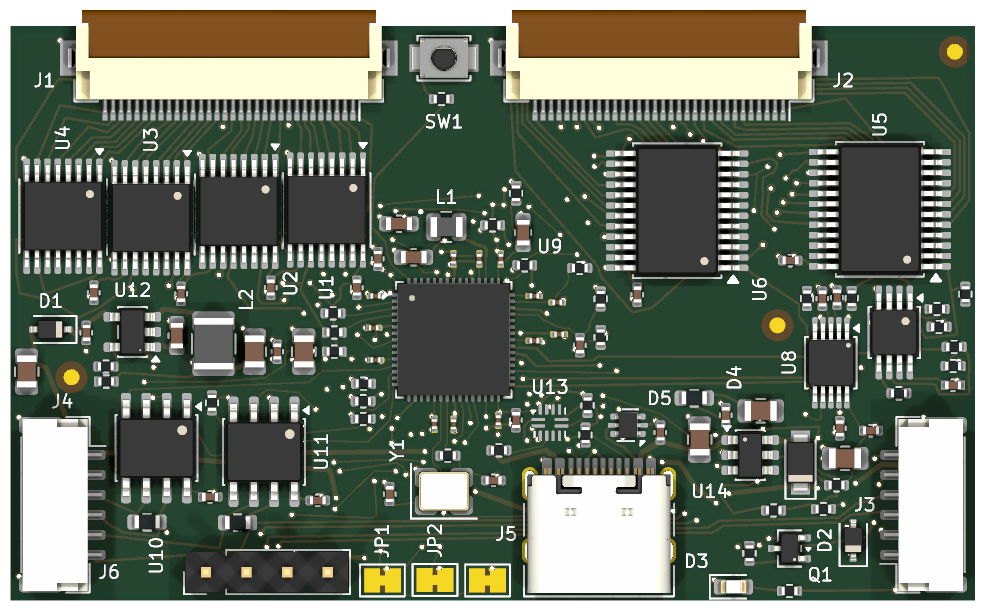
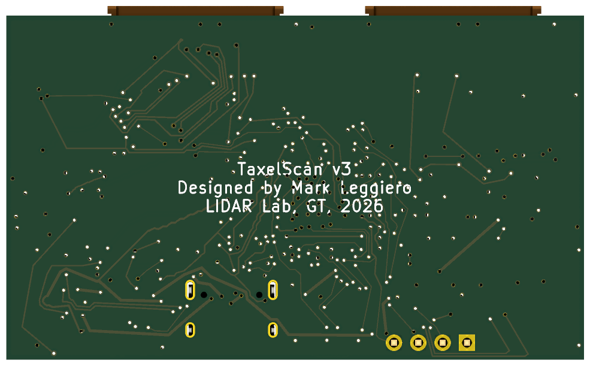

# TaxelScan v3

Reader board for a 32 × 32 carbon-nanotube tactile mat. Up to eight boards
share one RS-485 harness, start every frame on the same edge, and reach the
host through the first board's USB-C port.

> **Status, 28 Sep 2026:** designed and verified in KiCad, fabrication and
> assembly files ready, not yet built. Firmware not yet written. Every number
> below is a design value or a datasheet value, not a measurement.
>
> **4 Oct 2026:** [`boards/rev4/`](boards/rev4/README.md) is the same board
> without the external LTC1865L: both banks on the RP2354A's internal 12-bit
> ADC, about $14.60 of parts instead of $33.08, routed and DRC-clean. The
> numbers below are rev-3's.

| Top | Bottom |
|:---:|:---:|
|  |  |

Plan-view renders of `boards/rev3/rev3.kicad_pcb`, 60.3 × 35.9 mm.

## Key numbers

| | |
|---|---|
| Taxels | 32 × 32 = 1,024 per board; 8,192 on an 8-board harness |
| Converter | 16-bit SAR, 2 channels, 150 ksps max (LTC1865L) |
| Noise *(predicted)* | ≈ 17 LSB p-p ≈ 11.9 noise-free bits |
| Frame rate *(predicted)* | 60 Hz target for 8 boards; 11.2 ms scan, 89 fps ceiling |
| Controller | RP2354A: 2 × Cortex-M33 at 150 MHz, 520 kB SRAM, 2 MB flash in package |
| Board | 60.3 × 35.9 × 1.6 mm, 4 layers, all parts on top |
| Parts | 109 placed, 74 BOM lines, $33.08 per board |

## Signal chain

| Stage | Value | Part |
|---|---|---|
| Row drive | 32 rows at 3.29 V; unselected rows held at 0 V | 4 × SN74LVC595A |
| Column select | 2 banks × 16 columns | 2 × CD74HC4067 |
| Sensor, design basis | 1 MΩ at rest, 50 kΩ pressed (assumed) | CNT film |
| Pulldown | 10 kΩ, 0.1 %, 25 ppm/°C | R1, R2 |
| Sense node | 25 mV at rest, 435 mV pressed | |
| Gain | × 6 (10 kΩ / 2 kΩ) | TLV9062 |
| ADC input | 149 mV at rest, 2.61 V pressed; 51 Ω + 1 nF C0G (51 ns) | R21/R22, C31/C32 |
| Reference | row rail via 10 Ω + 10 µF ∥ 10 nF C0G (1.6 kHz), so the reading is ratiometric | R10, C10, C26 |
| Converter | INL ±8 LSB, no missing codes at 14 bits, 2 LSB RMS transition noise | LTC1865L |
| 1 LSB | 50 µV at the ADC, 8.4 µV at the sense node | |
| Settling *(predicted)* | 5.9 µs to 16 bits with ≈ 70 pF on the node | |

## Timing *(predicted)*

| Step | Time |
|---|---|
| One conversion: 16 SCK at 7.5 MHz + 5 µs | 7.13 µs |
| One mux channel, both banks, 6 µs settle | 20.3 µs |
| One row, 16 channels | 330 µs |
| One frame: 32 rows + 2 dark sweeps | 11.2 ms (18.9 ms at 2× oversampling) |
| Conditioning 1,024 taxels, second core | ≈ 3.5 ms |
| Sensor to host at 60 Hz | ≈ 22 ms + USB |

## Chain

| | |
|---|---|
| Boards per harness | 8, addressed by 3 solder jumpers (all closed = address 0) |
| Harness | JST GH 6-way, 26 AWG, 1 A, 4 m planned |
| Pinout | 1 +5 V · 2 GND · 3/4 DATA+/− · 5/6 SYNC+/−; J3 and J4 wired straight through |
| Transceivers | 2 × SN65HVD75: 20 Mbps, ±12 kV IEC 61000-4-2 on the bus pins |
| Data pair | half duplex, master polls; 12.5 Mbaud planned, 3 Mbaud for bring-up |
| Sync pair | master sends a 100 µs pulse per frame; every board starts on its falling edge |
| Termination | 120 Ω on the two end boards only |
| Frame size | 2,188 B with a 16-bit map · 1,676 B with 12-bit · 140 B contacts only |
| 8 boards at 60 Hz | 1.05 MB/s at 16 bits, 804 kB/s at 12 bits; bus 80 % and 63 % busy |

## Power

| | |
|---|---|
| Input | 5 V from USB-C or the harness, diode-OR (PMEG2005AEA) |
| 3.3 V rail | TLV62569 buck: 3.29 V (3.24–3.34 V) |
| Core rail | RP2354A internal buck with a 3.3 µH AOTA-B201610S3R3 |
| Draw, 8 boards *(estimate)* | 239 mA typical, 349 mA worst |
| Harness feed from USB | 321 mA (282–367) on a 500 mA port; 632 mA (570–703) on a 1.5 A or 3 A Type-C source |
| Boards per feed | 5–6 on a 500 mA port; 8 need a 1.5 A source |
| Protection | USBLC6-2P6 on D+/D−/VBUS · 1 Ω + 10 µF hot-plug damper · PMEG2010ER reverse block |

## Build

| | |
|---|---|
| PCB | JLCPCB, 4 layers, JLC04161H-7628, 1.6 mm, 1 oz outer |
| Rules | 0.10 / 0.10 mm trace/space in the fine-pitch areas, 0.15 / 0.15 elsewhere; 352 vias, 0.30 / 0.50 mm |
| Vias | epoxy-filled and capped (required: vias sit in pads) |
| Assembly | Standard PCBA, top side, 0201 smallest; resistors thin film 0.1 %, 25 ppm/°C |
| Files | `boards/rev3/fab/`: `rev3-gerbers.zip`; `rev3-bom.csv` + `rev3-cpl.csv` (109 parts); `-end` pair (111 parts, adds 2 × 120 Ω) |
| Parts cost | $33.08 per board for 10 boards at JLCPCB prices, 28 Sep 2026; the LTC1865L is $18.47 of it. PCB and assembly fees extra |
| Programming | USB-C with a BOOTSEL button, or SWD on a 2.54 mm 1 × 4 header |

Order options and what to check in the placement preview:
[`boards/rev3/fab/ORDER-NOTES.txt`](boards/rev3/fab/ORDER-NOTES.txt).

## Verify

```bash
cd boards/rev3
python gen_rev3.py      # writes rev3.net and BOM.csv, asserts every net
python check_faults.py  # injects 35 faults, each must be caught
python make_fab.py      # gerbers, drills, BOM, CPL, drawings
```

| Check | Result |
|---|---|
| Netlist assertions | 140 / 140 nets |
| Fault injection | 36 / 36 behave (35 faults + clean baseline) |
| ERC | 0 errors |
| DRC, zones filled, schematic parity | 0 unconnected, 0 copper errors |

## Open items

| Item | Value to confirm |
|---|---|
| Sensor pressed resistance | 50 kΩ assumed; sets R1/R2 and the gain |
| Hot-plug overshoot at the buck input | must stay under 6 V |
| Buck input on the 8th board | 3.58–4.03 V estimated, ≈ 3.6 V needed |
| USB throughput, 8 × 16-bit maps | 1.05 MB/s against a ≈ 1 MB/s CDC ceiling |
| Firmware | not written; specification in [`firmware/rev3/PLAN.md`](firmware/rev3/PLAN.md) |

Do not flash `firmware/taxelscan/` to a v3 board. It is the previous board's
sketch and drives GPIO22/23, which are an address strap and the power-fault
input on v3.

## Repository

```text
boards/rev3/          v3 KiCad project, netlist generator, fab/ package, design notes
boards/rev4/          rev-3 without the external ADC: project, fab/ package, placement analysis
firmware/rev3/        v3 firmware specification
firmware/rev3_power/  USB power policy, written and unit-tested
libraries/            shared symbols and footprints
boards/rev1/, firmware/taxelscan/, boards/v2-*/   earlier boards and their firmware
```

`tmp/` and `boards/rev3/backups/` are local working folders and are not in the
repository.

## Credits and license

Sensor pads, electrode geometry and the original readout topology come from the
FlexiTac project. MIT licensed; see [LICENSE](LICENSE).
