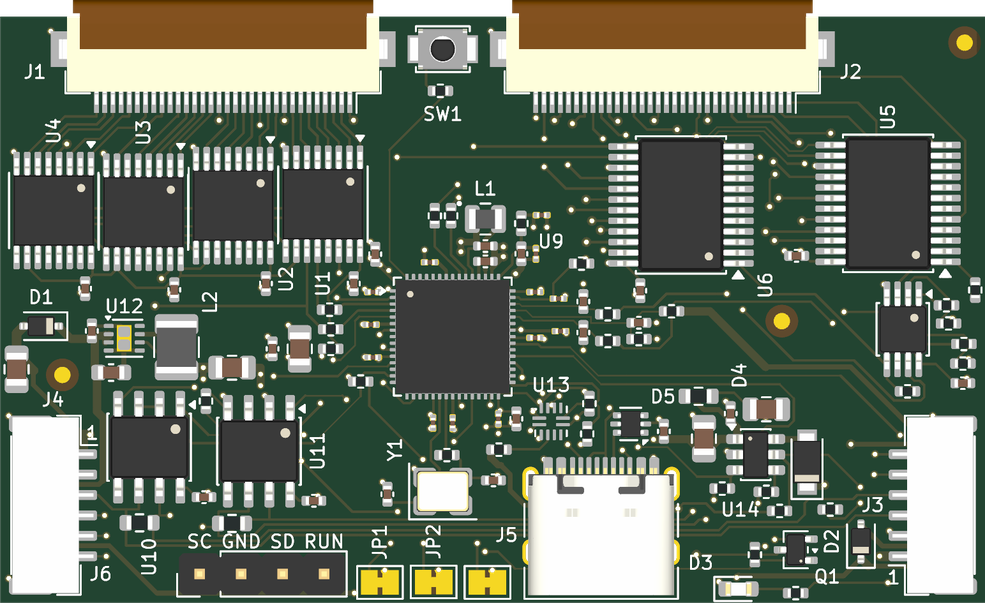
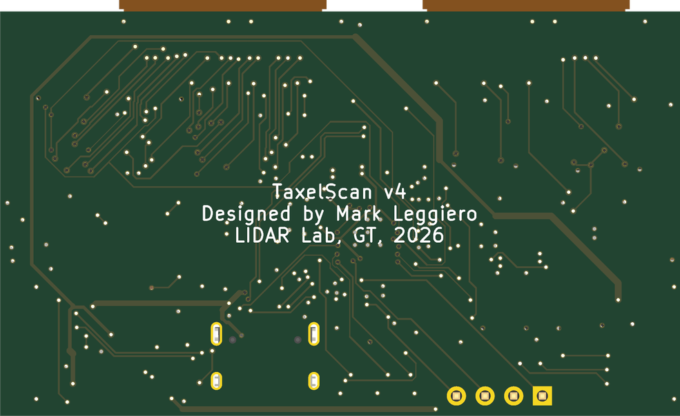

# TaxelScan v4

Reader board for a 32 × 32 carbon-nanotube tactile mat. Up to eight boards
share one RS-485 harness, start every frame on the same edge, and reach the
host through the first board's USB-C port.

> **Status, 8 Oct 2026:** designed and verified in KiCad. DRC and
> schematic parity are clean, every IC has been checked against its
> datasheet, and the analog chain and USB hot plug have been simulated.
> Fabrication and assembly files are ready; the board is not yet built and
> its firmware not yet written. Every number below is a design value or a
> datasheet value, not a measurement.

| Top | Bottom |
|:---:|:---:|
|  |  |

Plan-view renders of `boards/rev4/rev4.kicad_pcb`, 60.3 × 35.9 mm.

## Key numbers

| | |
|---|---|
| Taxels | 32 × 32 = 1,024 per board; 8,192 on an 8-board harness |
| Converter | the RP2354A's 12-bit SAR ADC, both banks in round robin, 500 ksps |
| Noise *(predicted)* | 1.6–2.3 LSB rms per conversion (ENOB 9.0–9.5) ≈ 8.1–8.6 noise-free bits; the front end adds 0.13 LSB rms |
| Frame rate *(predicted)* | 60 Hz target for 8 boards; 10.9 ms scan, 92 fps ceiling |
| Controller | RP2354A: 2 × Cortex-M33 at 150 MHz, 520 kB SRAM, 2 MB flash in package |
| Board | 60.3 × 35.9 × 1.6 mm, 4 layers, all parts on top |
| Parts | 102 placed (104 on the two end boards), 69 BOM lines, about $15 per board |

## Signal chain

| Stage | Value | Part |
|---|---|---|
| Row drive | 32 rows on the 3.3 V rail; unselected rows held at 0 V | 4 × SN74LVC595A |
| Column select | 2 banks × 16 columns | 2 × CD74HC4067 |
| Sensor, design basis | 1 MΩ at rest, 50 kΩ pressed (assumed) | CNT film |
| Pulldown | 10 kΩ, 0.1 %, 25 ppm/°C | R1, R2 |
| Sense node | 25 mV at rest, 435 mV pressed | |
| Gain | × 6 (10 kΩ / 2 kΩ) | TLV9062 |
| ADC input | 149 mV at rest, 2.61 V pressed; 51 Ω + 1 nF C0G (51 ns) | R21/R22, C31/C32 |
| Reference | ADC_AVDD: the 3.3 V rail through 10 Ω + 100 nF. The rows run from the same rail, so the reading is ratiometric | R26, C36 |
| Converter | 12 bits, ENOB 9.0 min / 9.5 typ; bank A on ADC1 (GPIO27), bank B on ADC3 (GPIO29); the rail monitor on ADC2 | RP2354A |
| 1 LSB | 806 µV at the ADC, 134 µV at the sense node | |
| Counts | about 185 at rest and 3,228 pressed; clipping below 38 kΩ | |
| Settling *(predicted)* | 5.0–6.6 µs to 0.5 LSB with 20 pF of column capacitance | |

## Timing *(predicted)*

| Step | Time |
|---|---|
| One conversion | 2 µs |
| One mux channel, both banks: 6.6 µs settle, a discard and a read per bank, firmware overhead | 19.4 µs |
| One row, 16 channels | 0.32 ms |
| One frame: 32 rows + 2 dark sweeps | 10.9 ms with 20 pF columns (92 fps); 12.0 ms with 50 pF (83 fps) |
| Conditioning 1,024 taxels, second core | ≈ 3.5 ms |
| Sensor to host at 60 Hz | ≈ 22 ms + USB |

## Chain

| | |
|---|---|
| Boards per harness | 8, addressed by 3 solder jumpers (all closed = address 0) |
| Harness | JST GH 6-way (GHR-06V-S housings, SSHL-002T-P0.2 contacts), 26 AWG, 1 A, 4 m planned |
| Wiring | pin n to pin n, from J3 of one board to J4 of the next; J3 and J4 are turned 180° to each other, so the wires cross between boards. Pin 1 is marked at both |
| Pinout | 1 +5 V · 2 GND · 3/4 DATA+/− · 5/6 SYNC+/−, the two pairs twisted |
| Transceivers | 2 × SN65HVD75: 20 Mbps, ±12 kV IEC 61000-4-2 on the bus pins |
| Data pair | half duplex, master polls; 12.5 Mbaud planned (PIO UART), 3 Mbaud for bring-up |
| Sync pair | master sends a 100 µs pulse per frame; every board starts on its falling edge |
| Termination | 120 Ω on the two end boards only |
| Frame size | 1,676 B with a 12-bit map · 140 B contacts only |
| 8 boards at 60 Hz | 804 kB/s with 12-bit maps; the bus 63 % busy |

## Power

| | |
|---|---|
| Input | 5 V from USB-C or the harness, diode-OR (PMEG2005AEA) |
| 3.3 V rail | TPS62162 buck, fixed 3.3 V (3.18–3.43 V); 3–17 V in, 20 V absolute maximum |
| Core rail | RP2354A internal buck with a 3.3 µH AOTA-B201610S3R3, laid out as Raspberry Pi's RP2350A minimal design |
| Draw *(estimate)* | 16–28 mA per board at 5 V, plus about 25 mA while a board transmits |
| Harness feed from USB | 321 mA (285–363) on a 500 mA port; 632 mA (576–697) on a 1.5 A or 3 A Type-C source |
| Boards per feed | 8 on a 500 mA port: seven downstream boards and one transmitter draw 140–225 mA |
| Far end | the eighth board's buck sees about 3.7–4.0 V from a 4.75 V source; it needs 3.3 V |
| Protection | USBLC6-2P6 on D+/D−/VBUS · 0.68 Ω + 22 µF hot-plug damper · PMEG2010ER reverse block |

## Build

| | |
|---|---|
| PCB | JLCPCB, 4 layers, JLC04161H-7628, 1.6 mm, 1 oz outer |
| Rules | 0.10 / 0.10 mm trace/space in the fine-pitch areas, 0.15 / 0.15 elsewhere; 300 vias, 0.30 mm drill / 0.50 or 0.60 mm pad |
| Vias | epoxy-filled and capped (required: vias sit in pads) |
| Assembly | Standard PCBA, top side, 0201 smallest; resistors thin film 0.1 %, 25 ppm/°C |
| Files | `boards/rev4/fab/`: `rev4-gerbers.zip`; `rev4-bom.csv` + `rev4-cpl.csv` (102 parts); `-end` pair (104 parts, adds 2 × 120 Ω) |
| Parts cost | about $15 per board for 10 boards at JLCPCB part prices (an estimate, not a quote); PCB and assembly fees extra |
| Programming | USB-C with a BOOTSEL button, or SWD on a 2.54 mm 1 × 4 header in Raspberry Pi's debug order (SC, GND, SD, RUN) |

Order options and what to check in the placement preview:
[`boards/rev4/fab/ORDER-NOTES.txt`](boards/rev4/fab/ORDER-NOTES.txt).

## Verify

```bash
cd boards/rev4
python gen_rev4.py      # writes rev4.net and BOM.csv, asserts every net
python check_faults.py  # injects 41 faults, each must be caught
python make_fab.py      # gerbers, drills, BOM, CPL, drawings
```

| Check | Result |
|---|---|
| Netlist assertions | 134 / 134 nets |
| Fault injection | 42 / 42 behave (41 faults + clean baseline) |
| ERC | 0 errors |
| DRC, zones refilled, schematic parity | 0 unconnected, 0 copper errors |
| Functional review | every IC against its datasheet, the analog chain and hot plug in ngspice: [`boards/rev4/VERIFICATION.md`](boards/rev4/VERIFICATION.md) |

## Open items

| Item | Value to confirm |
|---|---|
| Sensor pressed resistance | 50 kΩ assumed; sets R1/R2 and the gain |
| Column capacitance (mat + FFC) | unmeasured; a 6 µs settle covers about 20 pF |
| ADC noise and bank-to-bank carry-over | raw σ at rest, and whether a conversion must be discarded after each bank switch |
| Hot plug | +5V_USB and the buck input from the stiffest supply; simulated ≤ 6.78 V and ≤ 6.50 V |
| Core rail | VCORE at DVDD pin 23 under load steps, 1.05–1.16 V |
| USB throughput, 8 × 12-bit maps | 804 kB/s against a ≈ 1 MB/s CDC ceiling |
| Firmware | not written; specification in [`firmware/rev3/PLAN.md`](firmware/rev3/PLAN.md), which needs this board's ADC pin map (GPIO27 / 29) |

The smaller items, and what to measure at bring-up, are in
[`boards/rev4/VERIFICATION.md`](boards/rev4/VERIFICATION.md).

Do not flash `firmware/taxelscan/` to this board. It is an earlier board's
sketch and drives GPIO22/23, which are an address strap and the power-fault
input here.

## Repository

```text
boards/rev4/          the board: KiCad project, netlist generator, fab/ package, verification
firmware/rev3/        firmware specification
firmware/rev3_power/  USB power policy, written and unit-tested
libraries/            shared symbols and footprints
boards/rev3/, boards/rev1/, firmware/taxelscan/, boards/v2-*/   earlier boards and their firmware
```

`tmp/` and `boards/rev3/backups/` are local working folders and are not in the
repository.

## Credits and license

Sensor pads, electrode geometry and the original readout topology come from the
FlexiTac project. MIT licensed; see [LICENSE](LICENSE).
