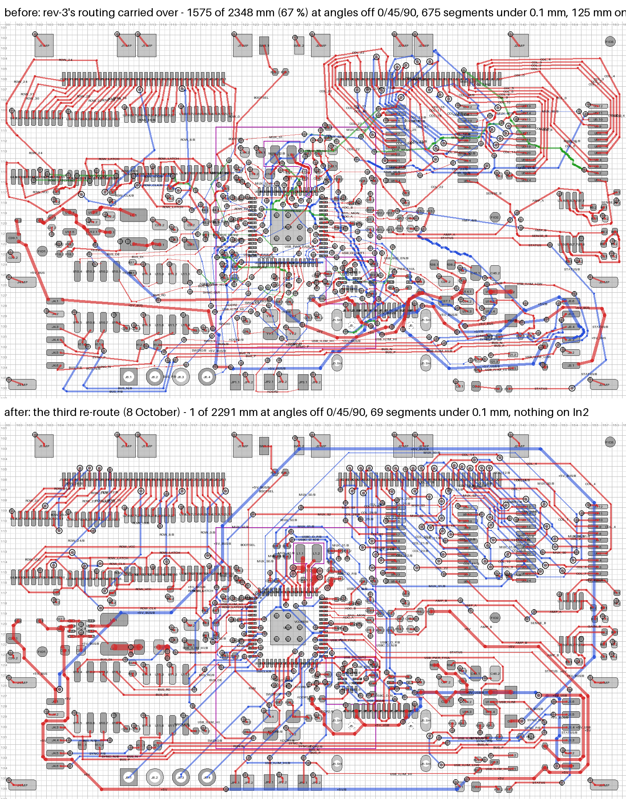

# Routing status — rev-4, 5 October 2026

`rev4.kicad_pcb` is **re-routed from scratch** for straight routing: every
signal track runs at 0, 45 or 90 degrees. The placement is the first rev-4's
([PLACEMENT.md](PLACEMENT.md)) to the nanometre; only the copper changed, plus
one ground via that moved into its pad (R27.2, below).

The first rev-4 kept rev-3's routing wherever the ADC change did not reach, and
rev-3's copper was jagged: grid-router staircases simplified by line of sight,
then a compaction pass (17 September) that let every corner drift. Two thirds of
it ran at arbitrary angles. That routing is in the history (commit `1b49e55`,
summarised at the end of this file). The first re-route (`a47fcb2`) left the
USB-C data lines to Freerouting; this one pre-routes them as a pair, and its
finish tidies what the rip-up loop leaves behind.

## Verified

Native KiCad **10.0.6** DRC with zones refilled and schematic parity against
`rev4.kicad_sch`, run by `tools/finalize_rev4.py`:

    unconnected   0
    copper        0   (clearance, shorts, hole clearance, widths, dangling: all zero)
    silkscreen    5 warnings - rev-3's same five: U1-U4's outlines touch in three
                  places; U14's over C42 pad 1, U9's over C33 pad 1
    parity        199 items, every one the leading-'/' local-label name or one of
                  J5's two SBU pins the sheet leaves open - the same as before.
                  Every net has the same pad membership as rev4.net

    ./gen_rev4.py         135 of 135 nets check out (netlist unchanged)
    ./check_faults.py     40 of 40 behave (39 injected faults + the clean baseline)

Every footprint and every pad is at exactly the position and rotation of the
board before the re-route, so `rev4-cpl*.csv` and `rev4-bom*.csv` are unchanged
and the paste, mask and silkscreen gerbers are identical apart from their dates.

## Before and after

| | first rev-4 (rev-3's routing) | first re-route (`a47fcb2`) | re-routed |
|---|---|---|---|
| copper off the 0 / 45 / 90-degree grid | **1575 of 2348 mm (67 %)** | 5.7 of 2394 mm (0.2 %) | **5.7 of 2311 mm (0.2 %)**, all of it GND / +3.3 V pad-to-via ties (4.9 + 0.8 mm) |
| segments shorter than 0.1 mm | 675 | 85 | 107 |
| track segments | 2318 | 1565 | 1588 |
| corners / corners sharper than 90° | 1745 / 36 | 986 / 5 | 1023 / 4 |
| copper per layer | F 1513, In2 125, B 710 mm | F 1462, In2 0, B 932 mm | F 1436, **In2 0**, B 875 mm |
| vias | 336 (112 GND, 34 +3.3 V, 190 signal) | 324 (178 signal) | **311 (112 GND, 34 +3.3 V, 165 signal)** |
| copper at the 0.10 mm minimum | 543 mm | 346 mm | 208 mm |
| via holes in SMD pad openings (`tools/via_in_pad.py`) | 136: 17 wholly, 119 partly; 37 one-pad passives | 120: 11 / 109; 35 | 120: 11 wholly, 109 partly; 35 |

`tools/jag.py` measures the first three rows. A segment counts as off the grid
when its direction is more than 1 degree from a multiple of 45.

## How it was routed

`tools/freeroute_rev4.py all`, then `tools/finalize_rev4.py`. Freerouting
does the bulk. The exact-geometry router (`tools/lr.py`, the model rev-3's
router used, with octilinear search added in `tools/rr3.py` and
`tools/grid_route3.cpp`) routes what Freerouting cannot be trusted with,
checks every segment it adds against the board's real rules, and finishes the
job.

1. **Strip.** Every signal track and via off (1997 tracks, 190 vias). The 146
   GND / +3.3 V vias and their 321 pad-to-via ties stay.
2. **Pre-route** (`tools/preroute_rev4.py`), on the empty board, in this order:
   - `VREG_LX`, the RP2354A regulator's switching node: pin 48 straight to L1,
     F.Cu, 0.2 mm, no via; and `SW_NODE`, the buck converter's: U12's switch
     pin to L2, F.Cu, 0.3 mm, no via (one Freerouting run sent it through two).
   - `USB_D_P` / `USB_D_N`: pins 52 / 51 sit 0.4 mm apart inside `U9_escape`,
     and Freerouting's single 0.15 mm clearance leaves them no way out. They
     go down through vias between the pin row and the exposed pad and across
     on B.Cu, as before, with F.Cu north of the pin row costed for them, since
     that is where `VREG_LX` and `VCORE`'s pin 50 leave.
   - **The ADC corner**, drawn: `ADC_B`, `RAIL_MON` and `ADC_A` leave pins 43,
     42 and 41 side by side, and `RAIL_MON` in the middle passes between C32
     and C31 (0.38 mm apart) and under R22. Freerouting left `RAIL_MON` open in
     every trial. Then `RAIL_MON`'s divider end, C45 to R15 / R16.
   - `VCORE`, the whole 1.1 V rail at 0.2 mm, kept out from under the QFN body.
     Freerouting twice left pin 50 (`VREG_FB`) boxed in.
   - **The USB-C data pair**, `USBC_D_P` / `USBC_D_N`: J5 through the ESD array
     D5 to the series resistors R23 / R24. J5's data pins interleave (B7 D-,
     A6 D+, A7 D-, B6 D+, 0.5 mm apart), so each line bridges its two pins, D-
     over the pin row and D+ under it. D5 has D+ on its bottom row and D- on
     its top, and a ground via and C38 close its east side, so D+ cannot get
     past D-'s row on F.Cu: the long run goes on B.Cu, the two lines side by
     side (F.Cu costed there), at 2 vias a line; on F.Cu it needed 2 more to
     pass under the ADC corner. First D5.5, the array's VBUS pin, which sits
     between the two data pins at 0.54 mm pitch with no room for a via in the
     pad: it gets a via in the middle of D5's body and a B.Cu tie to C38.
   - **J5's VBUS pins**: A4/B9 and A9/B4 tied under the pin row on F.Cu,
     0.3 mm, round D+'s bridge, and on to R34 (the TUSB320's VBUS_DET
     resistor) south of the receptacle's west shield pin. A4/B9 has pins
     0.25 mm away on both sides, a locating peg's hole south of it and U13
     1 mm north; the way under the row passes B8 at `U9_escape`'s 0.10 mm,
     which Freerouting does not have. With the pair in, one Freerouting run
     left the pad open and two others took `+5V_USB` to R34 on B.Cu, through
     the crowded corner south of the RP2354A, where the rip-up loop then
     churned.
   - **The plane ties redrawn** octilinear around all of that: 95 GND groups
     and 33 +3.3 V groups, none kept.
   - **The RS-485 pairs**, drawn (`tools/pairs_rev4.py`, below).
3. **Freerouting 2.4.1** on the remaining 178 connections, given a DSN
   rewritten by `tools/dsn_prep.py`:
   - In2 is a power layer, so no signal goes on the +3.3 V plane.
   - The clearance rule areas are not keepouts, which KiCad's exporter makes
     them.
   - The board's net classes: 0.3 / 0.4 mm power, 0.10 mm for anything on the
     0.4 mm-pitch parts, SENSE / GAIN / ADC / RAIL_MON on F.Cu only, 0.15 mm
     clearance everywhere.
   - The fiducials' 0.6 mm clearance.
   - The plane ties and the fourteen pre-routed nets as keepouts; the two
     VBUS ties as protected wiring, which it connects to but does not move.

   Fan-out and automatic neck-down are off: neck-down took tracks to 0.075 mm.
   37 passes and the optimiser, 10 minutes, 7 connections left open.
4. **Import** (`tools/ses_import.py`). The session onto the board. The plane
   ties and the pre-routed copper come back from the base exactly, and so does
   the placement: KiCad's importer applies the session's placement too, which
   the DSN carries to 0.1 µm, so footprints came back up to 67 nm off.
   KiCad's DRC found 0 copper violations at this point.
5. **Finish** (`tools/fr_finish.py`):
   - The 7 open connections are joined by octilinear rip-up and reroute, in
     5 rounds. All of them were round the RP2354A's south and east sides,
     where every net that leaves those pins for the east of the board has to
     cross the USB-C pair's B.Cu run. The planes' ties, the pre-routed nets
     and the regulator / crystal / `+5V_USB` nets are never ripped.
   - **The crystal**: Freerouting kept `XIN` and `XOUT_MCU` on F.Cu without a
     via this time (10.6 and 4.0 mm), so the redraw the first re-route needed
     had nothing to do.
   - **The op-amp outputs**: `AMP_A` / `AMP_B` had 27.3 mm on B.Cu, over the
     +3.3 V plane instead of ground. They are redrawn with B.Cu costed, so they
     use it only to cross SENSE_B: 2.6 mm.
   - **Tidy** (new): every signal net with a via is taken off alone and routed
     again with everything else in place, and kept only if that saves a via
     (at most a quarter longer) or, at the same vias, 1 mm; two passes. 17
     nets, 17 vias fewer: `USB_CC1`, `USB_CC_OUT1` and `COL_10` 4 to 2;
     `VREG_AVDD`, `BUS_DE`, `COL_21`, `ROW_11` and `SR_CHAIN_1` 2 to 0;
     `MUX_S0` 5 to 4. These were detours the rip-up loop left behind, routed
     round copper that was later ripped.
   - **Detours** (new): a short net still more than twice its pads' spanning
     tree is ripped with one or two of the nets whose copper lies between its
     pads, and all go back in, it first. `USB_CC2` had gone 30 mm round the
     south of J5, because `STATUS` and `USB_PWR_FAULT` ran down under J5's
     north edge on B.Cu; with those two it went back in at 8.7 mm, and the
     three together lost 23 mm and a via.
   - **Widths**: Freerouting routes a class at one width end to end, so every
     net touching the RP2354A or the TUSB320 was 0.10 mm from pin to far end.
     337 tracks (495 mm) were widened back to 0.15 mm after the rip-up and
     131 more (218 mm) after the tidy, wherever the exact check allowed.
     KiCad's DRC objected to none.

   In this run the tidy and detour passes were applied to the finished board
   (`fr_finish.py --tidy-only`) with the same code. In the script they come
   straight after the op-amp step.

The search in `rr3` is over (layer, cell, direction). A bend costs extra (45°
less than 90°), turns sharper than 90° are not allowed, and segments are only
ever merged runs of one direction. So everything it draws is octilinear by
construction, and every segment and via is re-checked exactly before it goes on
the board. The checks are 0.15 mm, 0.10 mm inside `U9_escape` / `U13_escape`,
a pad's own clearance (the fiducials' 0.6 mm), 0.25 mm to holes and 0.22 mm to
the edge.

## The RS-485 pairs

BUS and SYNC (RS-485; the SN65HVD75 is rated to 20 Mbit/s, the RP2350's UART to
9.375 Mbaud, so the firmware plan runs the bus as a PIO UART at 12.5 Mbaud) run
from J4 at the left edge to J3 at the right. J3 and
J4 are mirror images, so the four conductors reach J3 in the reverse of their
order at J4: each pair swaps P and N once, and the two pairs cross once. rev-3
laid them by hand for that reason, and its compaction then bent them off the
grid. A search with a lane per conductor, and N costed to follow P, still made
a tangle of the crowded J4 end, so they are drawn again for this placement
(`tools/pairs_rev4.py`):

- **Lanes.** Four straight F.Cu lanes from the transceivers to the USB-C
  receptacle, in J3's order from the top: SYNC_N, SYNC_P, BUS_N, BUS_P. Pitch
  is 0.30 mm within a pair and 0.35 mm between pairs. The corridor between the
  crystal's pads and the receptacle's front shield pins is 1.0 mm wide.
- **J4 end.** SYNC's legs drop to B.Cu beside J4 and run there coupled, under
  BUS's legs, coming up beside R12 (the pair crossing). SYNC swaps over and
  under R12.2. BUS_P threads the 0.26 mm between U10's pins and R11; BUS_N
  hops past it on B.Cu (BUS's swap).
- **J3 end.** SYNC continues on B.Cu, which is nearly empty there. BUS stays
  on F.Cu under R28 / R27, and BUS_N climbs between them to J3.4. R27.2's
  ground via stood in its way, so it moved into the pad; the board orders
  epoxy-filled, capped vias anyway (`fab/STACKUP-NOTES.txt`).

| pair | first rev-4 | re-routed |
|---|---|---|
| BUS | 61.0 / 61.0 mm, skew 0.02 mm, 2 / 2 vias, 74 % coupled | 53.8 / 54.4 mm, skew 0.55 mm, **0 / 2 vias**, 74 % coupled, P all on F.Cu |
| SYNC | 54.3 / 55.5 mm, skew 1.25 mm, 4 / 2 vias, 68 % coupled | 54.6 / 52.3 mm, skew 2.27 mm, 4 / 4 vias, **79 % coupled** |

"Coupled" is the share of N's length that runs at the pair's pitch beside P,
on P's layer. 2.3 mm of skew is about 15 ps, far inside a 50 ns bit.

## Other nets that changed character

| net | first rev-4 | re-routed |
|---|---|---|
| `VCORE` | 37.1 mm, 7 vias, 21.6 mm on In2, mostly 0.15 mm | 28.8 mm, 5 vias, none on In2, **0.20 mm** |
| `VREG_LX` | 4.7 mm F.Cu, partly 0.10 mm | 4.4 mm F.Cu, 0.20 mm |
| `XIN` / `XOUT` / `XOUT_MCU` | 10.2 / 3.2 / 3.9 mm F.Cu, 0.10 mm | 10.6 / 3.1 / 4.0 mm F.Cu, no vias, 0.15 mm but for 3.2 mm of `XOUT_MCU` at 0.10 mm |
| `USB_D_P` / `USB_D_N` | 5.7 / 4.6 mm, 2 / 2 vias | 5.7 / 4.8 mm, 2 / 2 vias |
| `USBC_D_P` / `USBC_D_N` | 30.7 / 18.4 mm, 4 / 3 vias, 3.6 mm on In2 (first re-route: 33.0 / 22.0 mm, 6 / 4 vias, not coupled) | **23.7 / 18.6 mm, 2 / 2 vias**, side by side on B.Cu, 42 % coupled, skew 5.1 mm |
| `AMP_A` | 20.8 mm, 2 vias (B.Cu 1.0) | 22.9 mm, 2 vias (B.Cu 2.6) |
| `AMP_B` | 20.6 mm, 2 vias (B.Cu 12.1) | 29.2 mm, no via, all F.Cu |
| `+5V` | 87.3 mm, 9 vias, 23 mm of it at 0.2 mm | 86.8 mm, 2 vias, all 0.3 mm |
| `+5V_BUS` | 75.3 mm, 6 vias | 84.7 mm, 2 vias, 0.3 mm |
| `+5V_USB` | 42.5 mm, 4 vias, 5.6 mm at 0.15 mm | 48.8 mm, 3 vias, 0.3 mm but for D5.5's 3.3 mm tie at 0.15 mm |
| `MUX_S0` - `MUX_S3` | 42.5 / 60.7 / 40.6 / 40.8 mm, 9 / 8 / 5 / 5 vias, 40 mm on In2 | 62.4 / 66.7 / 70.5 / 53.4 mm, 4 / 4 / 4 / 5 vias, none on In2 |
| `USB_ILIM` | 9.7 mm, no via | 12.8 mm, 4 vias |

SENSE_A / SENSE_B / GAIN_A / GAIN_B, ADC_A / ADC_B and RAIL_MON are on F.Cu
only, over the unbroken ground plane, as before.

## Planes

| | first rev-4 | re-routed |
|---|---|---|
| In2.Cu copper (signals on the +3.3 V plane layer) | 125 mm | **0** |
| +3.3 V pour on In2 | 2 pieces; main 1740.2 mm², 33 of its 34 vias | **1 piece, 1813.2 mm², all 34 vias** |
| GND plane on In1 | 1849.5 mm², one piece (+2 slivers of 1.2 mm²) | 1860.5 mm², all 112 GND vias (+ the same 2 slivers) |

rev-3 had 221 mm on In2 and seven pour pieces. The re-route puts nothing on
the plane layer at all, and the one +3.3 V via that sat on an island beside
U9's exposed pad is now on the main pour.

## Open items

From this re-route:

- Some nets went the long way round in this run: the mux selects
  `MUX_S0` - `MUX_S3` are 53 - 71 mm (first re-route 37 - 59 mm; still no more
  vias than the first rev-4 had, and none on In2), and `USB_ILIM` has 4 vias
  (first re-route 2, first rev-4 none). All static or slow signals. The
  USB-C pair's B.Cu run, D5 up to R23 / R24, is now crossed on F.Cu by every
  net that leaves the RP2354A's east side for the east of the board.
- `+5V_BUS` and `+5V_USB` are longer than the first rev-4's (85 / 49 mm
  against 75 / 43 mm), at full width and off In2.

Carried from rev-3, unchanged (see `../rev3/ROUTING_STATUS.md`): the crystal's
5 V proximity and missing guard, the USB policy's missing retry path, and
`RAIL_MON` watching `+5V` after the OR rather than `+5V_BUS`.

Closed by rev-4: **`ADC_CONV`** (59.6 mm, 9 vias, 40 % of its B.Cu run without
a reference plane, 0.18 mm from `VREG_LX`) no longer exists. The **firmware**
item's "no LTC1865L driver in the repo" no longer applies either: the rev-1
internal-ADC path is the starting point, on ADC1 / ADC3, with
`firmware/rev3_power` built with `-DTAXELSCAN_BOARD_REV=4`.

New to check at bring-up:

- **Bank-to-bank carry-over** through the shared SAR, with the 1 nF reservoirs
  at the pins. rev-1's test 0c (press a wired column, watch its partner)
  decides whether `adcDiscard` is still needed.
- **ADC_AVDD as the measurement reference**: scope it under a full scan. R26 /
  C36 were sized for an ADC that read a DC monitor.

## Reproducing it

    cd tools
    g++ -O2 -std=c++17 -o ../../../tmp/grid_route3 grid_route3.cpp
    python3 freeroute_rev4.py all ../rev4.kicad_pcb ../../../tmp/fr \
        --jar freerouting-2.4.1.jar --java /usr/lib/jvm/java-25-openjdk-amd64/bin/java
    python3 finalize_rev4.py ../../../tmp/fr/final.kicad_pcb
    cd .. && python3 make_fab.py

Freerouting's optimiser runs on three threads, so a second run will not give
the same tracks, only a board of the same kind. `tools/README.md` has the
setup: KiCad's Python, Java 25, and the Freerouting jar.

## History: the first rev-4 routing

rev-4 began as rev-3's routed board. U8 and its four support parts were
removed, seven parts moved beside the RP2354A's ADC pins (`PLACEMENT.md`), and
only the nets the change touched were re-routed, with rev-3's rip-up loop:
`ADC_A` / `ADC_B`, `AMP_A` / `AMP_B`, `RAIL_MON`, `USB_CC_OUT1` / `USB_CC_OUT2`
(moved to GPIO18 / 19), R15's `+5V` feed, and the `USB_ILIM` pair, which went
to 0.15 mm once `U8_escape` was gone. **FID2** moved 0.11 mm to keep its 0.6 mm
clearance from `AMP_A`. That board passed the same DRC and parity checks. The
re-route above replaced all of its copper and kept its placement, FID2's move
included.
