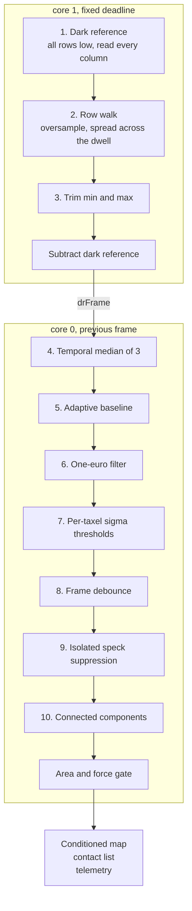
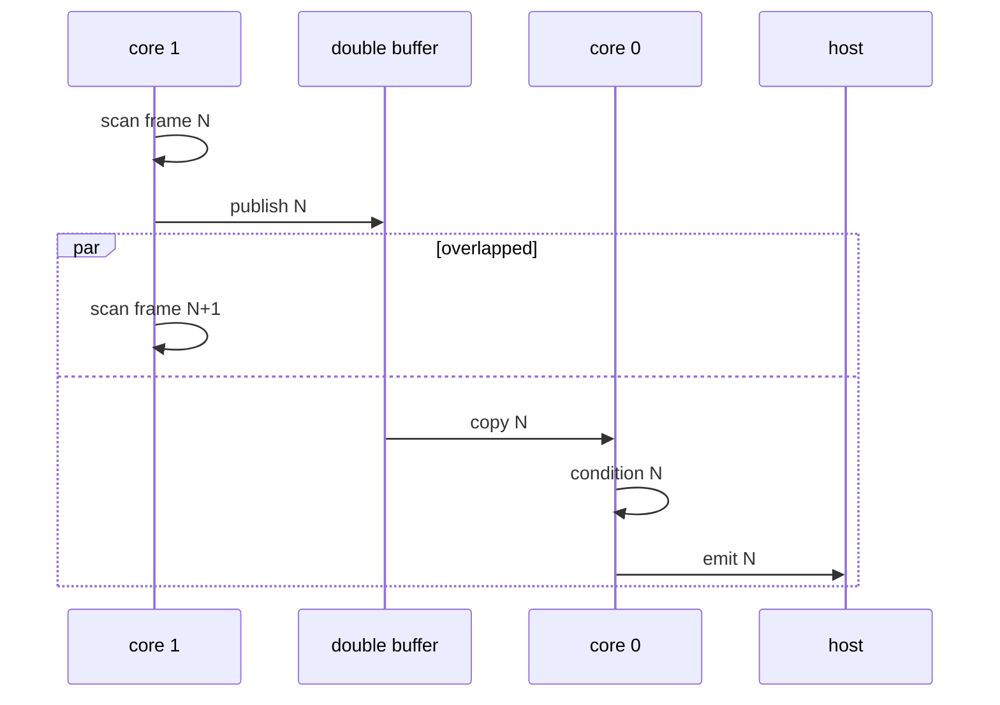

# Firmware

Firmware for the TaxelScan reader board. Scans a Velostat matrix, conditions
it on the microcontroller, and streams a cleaned map plus a contact list over
USB.

| File | Contents |
|---|---|
| `taxelscan/taxelscan.ino` | console, bring-up diagnostics, frame loop, status pixel |
| `taxelscan/scan.h` `.cpp` | pin map, row drive, mux, ADC, dark reference, core 1 loop |
| `taxelscan/condition.h` `.cpp` | the conditioning pipeline and contact extractor |
| `taxelscan/protocol.h` `.cpp` | binary frame format v2 |
| `taxelscan/options.h` | types for the runtime option table |
| `sim/` | builds `condition.cpp` natively and runs it against synthetic frames |
| `tools/` | live viewer, spectrum tool, protocol tests. See [tools/README.md](tools/README.md) |

## Build and flash

Install the Earle Philhower RP2040 core, not the official Arduino Mbed core.
This firmware uses the Pico SDK ADC, SIO and multicore headers, which only that
core exposes. Add this URL under Additional Boards Manager URLs, then install
"Raspberry Pi Pico/RP2040/RP2350":

```
https://github.com/earlephilhower/arduino-pico/releases/download/global/package_rp2040_index.json
```

The board is "Seeed XIAO RP2350". From the command line:

```bash
arduino-cli compile --fqbn rp2040:rp2040:seeed_xiao_rp2350 --build-path "$PWD/build" taxelscan
```

```bash
arduino-cli upload -p COM10 --fqbn rp2040:rp2040:seeed_xiao_rp2350 --input-dir "$PWD/build" taxelscan
```

Upload performs the 1200 baud touch and the UF2 copy itself. Keep only one
sketch's artifacts in a given build path, or upload will refuse to guess between
them.

`arduino-cli` ships inside the Arduino IDE install, so a separate download is
not needed. On Windows it is at
`%LOCALAPPDATA%/Programs/Arduino IDE/resources/app/lib/backend/resources/arduino-cli.exe`.

Verified with rp2040 core 6.0.0: compiles clean with `--warnings all`, 84 KB
flash, 123 KB RAM.

## The problem this firmware exists to solve

After a press is released, small patches keep reading as though something is
still there. Five different faults produce that symptom, they need different
fixes, and they can be told apart in about five minutes. Do this before tuning
anything.

### Check that it is in the sensor and not in the reader

Framing bugs in a host tool look exactly like sensor faults. Stop streaming,
switch to text, take one frame:

```
x
m 0
f
```

If the phantom is present in that single text frame, it is real. The viewer also
shows `desync` and `badcrc` counters, and both must stay at zero.

### Watch how it decays

| Behaviour after release | Cause | Handled by |
|---|---|---|
| Fades over 5 to 60 seconds | Velostat creep and recovery hysteresis | adaptive baseline |
| Rock steady, indefinitely | offset and leakage drift against the boot tare | dark reference |
| Mirrors a press onto the floating partner column | ADC channel switch bleed | `o discard 1` |
| Wanders or breathes with the arm powered | aliased interference | dwell spread, temporal filters |
| A whole row or column lifts under a hard press | 595 low side output under sneak current | measure before acting |

### The channel bleed test, thirty seconds

`scanFrame` reads ADC0 then ADC1 for the same mux channel, so column `k` and
column `chans+k` form a pair. With a 16 column pad, one of each pair is not
connected to anything. Set `g 32 16 2`, press hard on a wired column, and watch
its partner. If the partner moves, the sample and hold is carrying charge across
the channel switch. Toggle `o discard 0` and `o discard 1` to confirm.

### What it is not

Matrix ghosting. Unselected rows are driven low by the shift registers at about
25 ohms, so every sneak path ends at ground. A pressed taxel adds a parallel
path to ground on its column, which lowers other readings on that column rather
than raising them. Crosstalk here is negative and small, and it cannot create a
phantom contact.

## The conditioning pipeline



### Layer one: the dark reference

Twice per frame every row is driven low and every mux channel is read. With
nothing driving the matrix there is no current to steer, so that reading is
purely ADC offset, TLV9062 offset, CD74HC4067 leakage and whatever the supply is
doing at that moment. It is subtracted from every taxel.

Two properties make this the foundation of the whole design.

It stays valid under load. Pressing the mat cannot change a measurement taken
with no excitation. That gives a live re-zero which never needs an untouched
sensor.

A phantom with any electronic cause reads zero in this domain, while a real
contact reads full signal no matter how long it has been present, because the
reference is re-measured every frame.

Cost is about six percent of frame time. The reference is fed through a slow per
channel exponential average, set by `o darkshift`. That averaging matters
because one dark reading serves 32 taxels, so its own noise would otherwise
appear as common mode flicker down a whole column. The first sweep after reset
is loaded directly rather than eased in from zero, because ramping an average up
from nothing takes roughly 70 frames to get within one percent, and the startup
tare lands inside that window.

Toggle with `o darkref 0` and `o darkref 1`.

### Layer two: the adaptive baseline

The dark reference leaves exactly one thing behind, which is the film's own
state. Velostat really does stay conductive for seconds to minutes after a firm
press, and mounting preload really does change as an arm moves. Only a baseline
can remove that.

The rates are asymmetric, and the asymmetry is the opposite of the obvious one.

Falling is fast (`o fall`, 50 counts per second) and ungated. A baseline sitting
too high suppresses real contact, which is the dangerous direction on a robot,
and correcting downward can never eat signal.

Rising is slow (`o rise`, 3 counts per second) and heavily gated, because that
is the direction which can eat a contact. A real contact arrives in about 50 ms
and is worth hundreds of counts, while the baseline climbs a few counts per
second.

### Why a sustained contact cannot be absorbed

A baseline that only freezes while a taxel is active will eventually eat a
static grasp. Five mechanisms guard against that, and any one of them holds on
its own.

1. Freeze while active, plus a one taxel halo (`o halo`), so a spreading contact
   is not nibbled at its edges.
2. Spatial coherence gate on release. The stuck-active timeout may only fire for
   taxels that are not part of a coherent blob (`o coherent`, default 6 taxels).
   An isolated speck that has been on and perfectly still for 60 seconds is
   released. A 20 taxel grasp never is, however long it sits there.
3. Edge liveness. A real contact has a boundary of partly loaded taxels that
   fluctuate even when its centre is still. A live perimeter vetoes release
   regardless of area or elapsed time.
4. A hard cap on cumulative upward drift (`o maxdrift`, default 150 counts above
   the boot tare). Even with every heuristic above failing at once, the worst
   case is a bounded and reported loss rather than an open ended one.
5. All of it is reported. Adapted, frozen, released and capped counts ride in
   every frame trailer, and `B` dumps the baseline and sigma maps.

Set `o relen 0` to disable the release entirely if you would rather re-tare
between tasks than let anything adapt.

The simulator measures where the line falls. See [Simulator](#simulator).

### Notes on individual stages

**Dwell oversampling is the only anti-aliasing in the chain.** The netlist has
the TLV9062 output going straight to the ADC pin with no series resistor and no
capacitor. Per-taxel sample rate is the frame rate, so motor PWM, servo loops
and switching supplies all fold into the passband. `o ovs` samples spread over
`o spread` microseconds form a boxcar with nulls at `1/(ovs*spread)`. Use
`tools/spectrum.py` to find where to put that null, and note that below roughly
20 kHz the required dwell costs more frame rate than it is worth.

**The median runs before the baseline, not after.** Feeding an unmedianed value
to the baseline lets a single ADC spike perturb the baseline itself, and a
corrupted baseline outlives the spike by minutes.

**The median is not optional in front of the one-euro filter.** One-euro opens
its cutoff in response to a large derivative, which is the entire point of it,
and that means it chases impulses. Three frames of median in front is what stops
a single glitch from being tracked as a real onset.

**Speck suppression is not a 3x3 median.** A median would also erase a genuinely
thin contact such as a probe tip or the edge of a bracket. This only removes an
active taxel that has no active neighbour in the four directions.

**The area and force gate is what removes the reported symptom.** Blobs below
`o minarea` or `o minsum` are rejected, but they are still reported with a
rejected flag rather than silently vanishing, and `minarea` defaults to 2 so
thin contacts survive.

## Frame rate

Measured on hardware at 16x32 (512 taxels), read live from the binary stream.
The fps column comes from the sequence number delta rather than the period
field, so a board quietly dropping frames cannot flatter itself.

| Config | Period | fps | Scan | Cond | Emit | Core 0 |
|---|---|---|---|---|---|---|
| ovs2 spread2 s15 (default) | 12500 us | 79.9 | 10.86 ms | 1.76 | 1.28 | 24% |
| ovs1 spread2 s15 | 10000 us | 100.1 | 8.16 ms | 1.72 | 1.25 | 30% |
| ovs1 spread0 s12 | 8000 us | 125.0 | 7.34 ms | 1.96 | 1.25 | 40% |
| ovs1 spread0 s8 | 6500 us | 153.9 | 6.16 ms | 2.04 | 1.41 | 53% |
| ovs1 spread0 s5 | 5600 us | 178.6 | 5.26 ms | 1.76 | 1.32 | 55% |
| ovs1 spread0 s3 | 5000 us | 200.0 | 4.73 ms | 1.76 | 1.36 | 62% |

The scan is the limit at every operating point. Core 1 runs the matrix on a
fixed deadline while core 0 runs the pipeline and the USB write against the
previous frame, so conditioning never adds to the frame period. It would only
matter if it stopped fitting inside that period, and at 200 Hz it is still 62
percent of the budget.

200 Hz, verified over 15 seconds (2999 frames, zero new overruns):

```
g 16 16 2
o ovs 1
o spread 0
s 3
o period 5000
```

Two things are given up at that setting, and neither is small.

**Settle time below about 12 us is unvalidated.** The table above measures
timing, not whether the sense node has settled. Too short and readings compress
toward zero, which is fast and wrong. Run `p <r> <c>` with a sustained press on
that taxel. Values climb and then plateau, and the knee roughly doubled is the
setting you want.

**`ovs 1 spread 0` removes all anti-aliasing.** See the note on dwell
oversampling above.

Avoid `s 10` exactly. It sits on a reproducible timing cliff, 55 ms against
6.2 ms at 11 us and 5.4 ms at 8 us. Both 9 and 11 are fine.

### Reading the timing telemetry

`scanUs`, `condUs` and `emitUs` ride in every frame trailer, and `T` prints the
verdict:

```
# scan takes 10490 us; frame period is 12500 us
# fits, 2010 us of headroom (80 fps)
# core 0: cond 1760 us + emit 1360 us = 3120 us (25% of the period)
# limit is the SCAN (core 1)
```

`emitUs` is the CRC plus the USB write for the previous frame. At around 1.3 ms
it is over forty percent of core 0's load, so if core 0 ever does become the
limit, that is the first place to look rather than the filtering.

`overruns` is cumulative from boot and never resets. An absolute reading answers
"has this board ever overrun", not "is it overrunning now". Difference it across
a window, or watch the viewer's counter for movement.

## The startup reference

Every boot the firmware scans 8 warm-up frames, discards them, then averages 32
more and makes that the resting reference for every taxel. That value is
`tare0`, which defines zero force and which the drift cap hangs off.

A startup tare is blind by construction. Whatever is on the mat at boot becomes
the definition of zero, so a robot that powers up with its palm against a
bracket will not see the bracket. It self heals once the load lifts, because the
ungated fast fall walks the baseline down within a few seconds, but until then
the sensor is quietly deaf in that patch.

So the tare is checked two ways:

| Method | Catches | Misses |
|---|---|---|
| Against the stored reference (`X`) | anything, including a load spread evenly over the whole pad | nothing until the mounting itself changes |
| Against the array median (fallback) | a localised load | a load pressing on everything at once, because the median moves with it |

Simulation test G measures the difference. A uniform 300 count load was flagged
by zero taxels using the shape test and by all 384 using the stored reference.
That is the argument for pressing `X` once, on a clear mat, after the sensor is
mounted in its final position.

A suspect tare is reported on the console, sets bit 4 of the frame flags, turns
the status pixel orange, and raises a banner in the viewer. It never blocks
startup, because a suspect baseline still beats no baseline.

## Status pixel

The onboard RGB pixel is a pressure gauge. Brightness is fixed and low, and only
the hue carries information. Colour follows the peak of the gated map, so a
rejected phantom cannot light it.

| Colour | Meaning |
|---|---|
| Green | idle, powered, nothing in contact |
| Blue | lightest accepted contact |
| Magenta | about half of `o ledfull` |
| Red | `o ledfull` and above |
| Yellow | taxels pinned at the drift cap |
| Orange | the startup tare looked loaded |
| White | frames are overrunning the fixed cadence |

Pressure walks upward through the hue space from blue, so it passes through
violet and magenta to red and never through green or yellow. That leaves those
two free to mean something else without any ambiguity against a pressure
reading.

`o ledbright` is the single brightness dial, raw 0 to 255, default 36. `o led 0`
turns the pixel off.

The write policy matters as much as the colours. An earlier version swept a
rainbow every 20 ms, which is a WS2812 burst plus a step in 5 V load at about
50 Hz, sitting right next to the frame rate and beating against it. It appeared
in the data as a slowly moving pattern. The pixel is now written only when the
value it would display actually changes, quantised to 32 levels, and never more
than 20 times a second. At rest it is not written at all.

## Tuning

Everything is a runtime option. `o` with no arguments lists all of them with
their current values. `o <name> <value>` sets one.

Order of operations on a new mat:

1. `g 16 16 2`, or whatever the geometry is, then `T` to confirm the scan fits
   the frame period. If it says TOO TIGHT, follow what it suggests.
2. `p 4 4` for a settle sweep on one taxel while pressing it. Take the knee,
   roughly double it, set it with `s <us>`, then run `T` again.
3. `t` to tare with the mat at rest. This also sets the drift cap.
4. `X` once, on a clear mat, in the final mounted position, to record the boot
   reference.
5. `n 30` to characterise per-taxel noise. Do this under the noise the sensor
   will actually face, meaning with the arm powered and moving if it has one. On
   a quiet bench this measures close to zero and the absolute floors dominate
   instead.
6. Soak with `python tools/taxelscan_live.py --port COM10 --log soak.csv`, then
   read the CSV.

If phantoms persist, raise `o minarea` to 3 or raise `o minsum`. If real
contacts are being missed, lower `o kon`, `o minon` or `o non`. Change one at a
time and re-run the soak.

Defaults:

```
geometry     16 x 16 x 2 = 512 taxels
period       12500 us          settle 15 us    rowSettle 5 us
ovs 2        spread 2 us       trim on         discard on
darkref on   darkshift 4       maskirq on
fall 50      rise 3            release 10      maxdrift 150
stucksecs 60 stillness 24      coherent 6      halo on
kon 6        koff 3            minon 25        minoff 12
non 3        noff 5
median on    euro on           fcmin 1.0       beta 0.05    dcut 1.0
despeckle on minarea 2         minsum 120      gate on
ledbright 36 ledfull 800
```

## Console

```
f            one frame
c / x        start / stop continuous
t            tare, sets the baseline and the drift cap
z            toggle map gating, off shows everything the filter rejected
g R C B      geometry: rows, mux channels, banks (1 or 2)
s <us>       sense settle time
w <us>       row settle time
m <0|1|2>    output: 0 text, 1 csv, 2 binary v2
o [nm] [v]   list or set a pipeline option
n <secs>     characterise per-taxel noise, save sigma to flash
v r c [n] [kHz]   raw ADC dump on one taxel, for spectrum.py
B            dump the baseline and sigma maps
X            save the current tare as the boot reference, clear the mat first
R            reset the pipeline state
T            time one frame against the fixed cadence
i            show config

bring-up commands, all of these stop streaming first:
d            diagnostics
y            connectivity sweep, finds open electrodes, needs no press
q            row independence probe
b a|n|<row>  bit-bang the shift registers
u            ROW_VCC rail monitor, wire D2 to R5
e <row>      row output walk, wire D2 to one row pin
k a|n|<row>  park the row drive for probing with a meter
p <r> <c>    settle time sweep on one taxel
```

Every command that pauses the scan resumes it when it finishes. The exceptions
are `k` and `b`, whose whole purpose is to leave the matrix parked for a meter,
and those say so on the console.

## Bring-up on a freshly assembled board

Run `i` then `d` before connecting a sensor. With no sensor attached, `d` should
report ADC_A and ADC_B means near zero, because the 3.3k pulldowns hold both
sense nodes at ground through the buffers. A large or noisy reading there means
a solder fault on the buffer, the pulldown or the ADC line, and nothing
downstream will be trustworthy.

Attach a sensor and run `d` again. A row that reads flat or zero across every
column is a dead shift register output or a dead row electrode. A column that
reads flat or zero down every row is a dead mux channel or a dead column
electrode.

### Finding open electrodes without pressing: `y`

Driving one row and reading one resting taxel is hopeless. A resting taxel is
megohms, worth a couple of LSB against a 3.3k pulldown. `y` drives all rows high
at once instead, so every column is pulled up through roughly 32 taxels in
parallel, which is about 30 times lower source impedance. A connected column
then reads tens of counts at rest while an open one sits at the ADC offset
floor, and the two separate cleanly.

### Separating a dead driver from an open connector: `k`

The readout is sense side only, so a dead shift register output and an open
connector look identical from the ADC. `k a`, `k n` and `k 7` park the drivers
so a meter can tell them apart. Parking survives until the next scan.

### Diagnosing a dead row axis: `q` and `b`

`q` probes each row alone against a bracketing all-rows-low baseline, in bit
reversed order. The shuffling matters. Sweeping rows 0 to 31 in order over about
250 ms cannot distinguish a spatial profile from the time profile of a press
being applied and released, because both are a hump. A signal that follows the
row index is spatial, and one that follows the probe sequence is the operator's
hand. The viewer reports both roughness figures and says which.

`b a` and `b n` bit-bang the same pins with plain GPIO. If `b` produces a swing
where normal scanning does not, the fault is in firmware rather than hardware.

### Why this firmware does not use SPI

`SPIClassRP2040::begin()` calls `gpio_set_function(_RX, GPIO_FUNC_SPI)` on its RX
pin. The `seeed_xiao_rp2350` variant defines `PIN_SPI0_MISO` as GPIO4, which on
this board is MUX_S0. Calling `SPI.begin()` therefore takes the mux select line
away from the SIO block and disables its output driver, even though the sketch
never reads a byte back.

Bit-banging the shift registers costs about 3 us per row against a 12.5 ms
frame, so there is nothing to win by fighting the core over pin ownership. If
you reintroduce SPI here, call `SPI.setRX(NOPIN)` before `begin()`.

## Core split



Core 1 owns the matrix and scans on a fixed deadline. Core 0 conditions and
talks to USB, working on the frame core 1 finished during the previous period.
Anything on core 0 that drives the hardware, which includes every bring-up
diagnostic, calls `needIdle()` first and waits for core 1 to let go.

The cadence is fixed rather than free running for two reasons. The one-euro
filter needs a known `dt` or its cutoff wanders with serial load, and a
stationary sample clock makes interference stationary too, which is what makes
it filterable. Missed deadlines are counted rather than absorbed.

Core 1 sleeps rather than spins while idle and while waiting on the deadline. A
tight loop there is core 1 hammering the bus while core 0 works, and the
contention is not free. A settle time sweep found one dwell length where the two
cores beat against each other badly enough to make the scan ten times slower.

## Binary frame format v2

```
offset  0   'F' 'T'                 magic
        2   version = 2             u8
        3   flags                   u8
        4   seq                     u16
        6   rows, cols              u8 u8
        8   payload length          u16
       10   frame period            u32, microseconds, measured
       14   die temperature raw     u16, ADC channel 4
       16   ROW_VCC raw             u16, ADC2, only if D2 is wired to R5
       18   nContacts               u8
       19   nRejected               u8
       20   header CRC16            u16
       22   payload                       rows*cols int16, contacts, trailer
            payload CRC16           u16
```

Flags: 1 gated, 2 conditioned, 4 dark reference on, 8 sigma characterised,
16 tare suspect.

Contact record, 20 bytes packed: `id, area, sum (i32), peak, peakR, peakC,
cenRQ8, cenCQ8, r0, c0, r1, c1, flags, pad`.

Trailer, 28 bytes: `adapted, frozen, released, capped, suppressed, activeCells`
as u16, then `overruns, scanUs, condUs, emitUs` as u32.

The header carries its own CRC, checked before the length field is used. A
reader must never allocate or skip based on a length it has not verified. Under
the previous magic-only framing, a single dropped byte let the reader lock onto
a false `FT` inside the payload, after which the next frame's header decoded as
pixel data. Misaligned decoding repeats a fixed pattern down every row, which is
indistinguishable by eye from a row axis hardware fault.

Samples are signed. A negative value means that taxel's baseline has drifted
above its true resting level, which suppresses real contact. That is the
dangerous drift direction, so it is never clamped away at the source.

`tools/test_protocol.py` builds frames byte for byte the way `emitBinV2()` does
and runs them through the viewer's parser, including the exact failure modes
above. It needs no hardware.

## Simulator

`sim/` compiles `condition.cpp` unmodified against shim headers and runs it on a
PC against synthetic frames. A Python model of the baseline logic would only
tell you whether the model is correct. This exercises the code that goes on the
board.

```bash
cd sim
build.cmd
sim.exe 30
```

Requires Visual Studio Build Tools with the C++ workload. The script locates
Visual Studio through `vswhere`, or uses `cl.exe` if you are already in a
Developer Command Prompt. The argument is how many minutes the sustained contact
test holds its contact.

Results at the default parameters, 16x32, 40 fps, 2.5 counts rms noise:

| Test | Result |
|---|---|
| A. Real contact held 30 minutes | sum 9638 to 9620, a 0.2 percent change which is all noise. Area never shrank, never dropped for a frame |
| B. Stuck offset, by size | area 2 cleared in 62 s. Areas 9, 13 and 45 held indefinitely |
| C. Single taxel phantom | never reported, never in the map |
| D. Creep tail, tau = 20 s | map clears 76 s after release |
| E. Ten minutes of pure noise | zero false positives in 24000 frames |
| F. Tared while loaded, then unloaded | 296 counts surfaced as negative, recovered in 5.7 s |
| G. Loaded at startup detection | shape test caught a localised load, 17 taxels at +396 over a median of 31, and did not false alarm on a clear mat. A uniform 300 count load was invisible to the shape test and caught only by the stored reference |

Test B is the design's real tradeoff and worth reading carefully. A stuck offset
smaller than `o coherent` (default 6 taxels) is walked back automatically. One at
or above it is held until it physically decays, because the coherence gate
refuses to erode anything big enough to be a real contact. That is deliberate
and it is the price of test A passing. If your phantoms are larger than 6
taxels, lower `o coherent`, and understand that you are accepting that a
genuinely small sustained contact will eventually be absorbed.

What the simulator cannot tell you is anything about the real mat, the real
noise or the real interference. Velostat creep there is a modelled exponential.
Use it to check logic and pick starting parameters, then use the hardware
procedures above to check the sensor.
