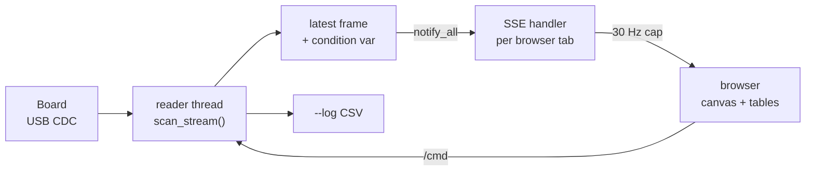

# Host tools

Three Python programs. Only the viewer needs hardware.

| Tool | Needs a board | Purpose |
|---|---|---|
| `taxelscan_live.py` | yes | live heatmap, contact overlay, telemetry, soak logging |
| `spectrum.py` | for capture only | find out what interference is actually present |
| `test_protocol.py` | no | round trip tests for the wire format |

Requirements: Python 3.8 or newer and `pyserial`. `numpy` is optional and only
speeds up `spectrum.py`, which falls back to a built in FFT without it.

```bash
pip install pyserial
```

## taxelscan_live.py

```bash
python taxelscan_live.py --port COM10
python taxelscan_live.py --port COM10 --log soak.csv
python taxelscan_live.py --port /dev/ttyACM0 --http 8080
```

Opens the serial port, puts the board into binary mode, starts continuous
scanning, and serves a page on http://localhost:8000.

Only one process can hold the serial port. Stop the viewer before flashing.

### Data flow



One reader thread owns the port and keeps only the newest complete frame. The
board can produce frames faster than a browser can draw them, so intermediate
frames are dropped rather than queued, which keeps displayed latency flat.

Streaming handlers wait on a condition variable rather than polling. An earlier
version slept a fixed slice and checked, and two independent pollers on
different cadences aliased against each other badly. The measured result was 11
events per second out of a possible 30 with the board running at 80 fps. A
condition variable with `notify_all` also lets several browser tabs watch at
once, which an `Event` would not, because each tab clearing it would steal
wakeups from the others.

### What the page shows

The header carries geometry, peak, mean, frame period, browser frame rate,
contact counts, and three health counters that should all stay at zero:

- `desync`, valid frames that did not start where the previous one ended
- `badcrc`, frames rejected by the payload CRC
- `stalls`, times the watchdog had to restart the stream

The telemetry strip below it shows pipeline state (conditioning, gating, dark
reference, sigma, tare) and per frame numbers from the board: active cells,
adapted, frozen, released, capped, specks, overruns, scan time, conditioning
time, core 0 load as a percentage, die temperature and the ROW_VCC reading.

The heatmap draws the gated map. Cells reading negative are drawn in purple.
That is not noise and it is not zero. It means the baseline for that taxel has
drifted above its true resting level, which suppresses real contact, and it is
the drift direction that matters on a robot. Accepted contacts get a green
bounding box with a dot at the centroid, rejected ones a dashed red box.

Controls cover tare, gate toggle, pipeline state reset, frame timing, saving the
boot reference, turning conditioning and the dark reference on and off for A/B
comparison, geometry presets, autoscale, peak hold, and two guided procedures
described below.

### The watchdog

Any console command that needs the matrix stops the scan, and the fire and
forget `/cmd` endpoint never turns it back on. That combination used to silence
the board permanently: one click on tare and the display froze, which looks
exactly like a dead sensor.

The firmware now resumes streaming by itself after any command that paused it.
The viewer keeps a watchdog as a second line of defence. If no frame arrives for
1.5 seconds it re-sends `m 2` and `c`, and counts it. The `stalls` counter in
the header is that count, so a stall shows up as a number rather than as
apparent silence.

### Guided procedures

**Nine point scan.** Walks corners, edge midpoints and centre with an on screen
countdown, recording peak per taxel at each stop, then tabulates peak value, its
row and column, and how many distinct rows and columns responded. Prompts are on
the page rather than in a terminal, because the person with their hands on the
mat cannot see terminal output.

**Row independence test.** Runs the board's `q` probe and interprets the result.
Each row is held high on its own, in bit reversed order, bracketed by all rows
low readings. The shuffling is what makes the answer trustworthy: sweeping rows
in order cannot distinguish a spatial profile from a press being applied and
released, because both are a hump. The viewer compares how smooth the response
is by row index against how smooth it is by probe order, and says which. If it
tracks probe order, that is the operator's hand, not the sensor.

**Noise characterisation.** Runs `n 30` on the board and shows the resulting
sigma summary. Do this under the noise the sensor will actually face. On a quiet
bench the filtered output has almost no variance left to measure, sigma comes
back near zero, and the absolute threshold floors dominate instead.

### Soak logging

`--log soak.csv` writes one row per frame:

```
t, seq, period_us, scan_us, peak, mean, active, adapted, frozen, released,
capped, suppressed, overruns, cond_us, emit_us, contacts, rejected, die_c,
rail_v, desync, badcrc, stalls
```

This is what a long run should be judged from rather than watching a heatmap.
Useful checks:

- `contacts` should be zero for the whole file with nothing on the mat
- `capped` going above zero means taxels are pinned at the drift cap and a
  phantom will reappear there
- `overruns` is cumulative from boot, so difference it rather than reading it
  absolutely
- plotting `peak` against `die_c` will show whether drift tracks temperature

### Frame parsing

The parser validates every frame's 20 byte header CRC before using its length
field, walks frame to frame using that length, and computes the payload CRC only
on the frame it is about to decode. Payload CRC in pure Python is roughly a
microsecond per byte, and at 80 frames per second checking every payload was
enough to starve the streaming threads.

This does not weaken the guarantee that matters. Every frame is still walked
through its own verified header, so a dropped byte still breaks the chain and
still surfaces as a desync. What is skipped is payload verification on frames
that are about to be discarded anyway.

## spectrum.py

```bash
python spectrum.py --port COM10 --row 4 --col 4
python spectrum.py --port COM10 --row 4 --col 4 --n 4096 --khz 192 --save dump.txt
python spectrum.py --file dump.txt
```

Parks one taxel, samples the ADC at a known fixed rate through the FIFO, and
transforms the result. This exists because there is no anti-alias filter
anywhere in the signal chain. The TLV9062 output goes straight to the ADC pin
with no series resistor and no capacitor, and each taxel is sampled once per
frame, so everything above half the frame rate folds down into the passband.

On a bench that mostly does not matter. On a robot it does. Motor PWM, servo
current loops and switching regulators all alias to some arbitrary low frequency
and appear as a patch drifting around the map, which by eye is indistinguishable
from a light touch. Guessing which one is responsible wastes a day.

Run it twice, once with the arm powered but stationary and once with it moving.
The difference is the part you can do something about.

Output looks like this:

```
   freq Hz    counts   x floor     dwell   cost at 512 taxels
   24000.0    18.026     259.7       42us      42 fps  reachable

Strongest REACHABLE line is 24000 Hz. Null it with:
    o ovs 2
    o spread 21
which makes the dwell 42 us and puts a boxcar null on 24000 Hz and its harmonics.
```

The cost column is the point. N samples spread over T microseconds form a boxcar
with its first null at 1/T, so the dwell is pinned at 1/f regardless of how many
samples fill it. Only the frequency decides whether the notch is affordable. A
1 kHz line needs a 992 us dwell, which at 512 taxels is a 500 ms frame, and the
tool says NOT reachable rather than suggesting it. Below roughly 20 kHz the
answer is usually that a dwell notch is not the fix and shielding is.

The tool also reports what the strongest line aliases to at the current frame
rate. If that lands near zero it will read as a steady offset rather than a
shimmer, which is the worst case, because no temporal filter can remove it. In
that situation nudging the frame period moves the alias somewhere visible.

`--taxels`, `--settle` and `--period` describe the configuration you intend to
run, and default to the 16x32 defaults in the firmware.

## test_protocol.py

```bash
python test_protocol.py
```

Builds frames byte for byte the way `emitBinV2()` does in the firmware, then
runs them through the viewer's own parser. No hardware and no serial port. If
the firmware layout changes and this file is not updated, the tests fail, which
is the intent: this file is the format's specification as much as it is a test.

It covers the ordinary round trip, back to back streams, a full size frame
against the firmware's transmit buffer limit, and four failure modes:

- `FT` appearing inside payload data, which must not create a false frame
- a dropped byte mid stream, which must be reported as a desync and must never
  be decoded as data
- a bit flip in the payload, caught by the payload CRC
- a bit flip in the length field, caught by the header CRC before the length is
  used

Those are not hypothetical. Under the previous magic-only framing, a single
dropped byte let the reader lock onto a false `FT` inside the payload, after
which the next frame's header decoded as pixel data. Misaligned decoding repeats
a fixed pattern down every row, which looks exactly like a row axis hardware
fault, and it was diagnosed as one for most of a day. The value that finally
gave it away was a sample reading 21574, which is `F` and `T` little endian.
